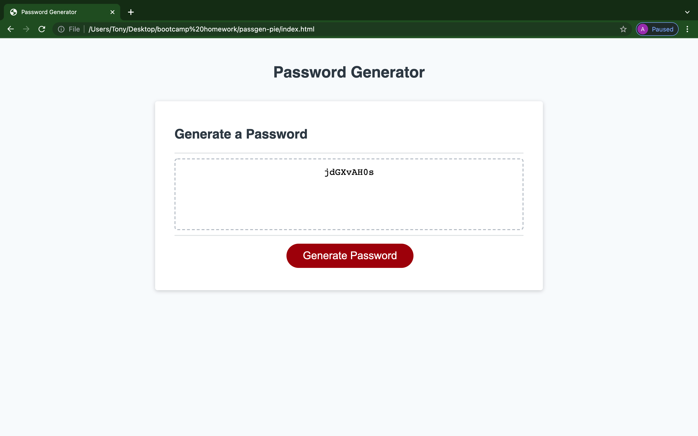

# passgen-pie

In this repository I built a random password generator. The requiremtns for this generator was that

1. It has between 8 and 128 characters
2. It has prompts and confirmation window for users to interact
3. It allows upper, lower, and special characters as well as a numbers.

This repository shows the connection between HTML, CSS and Javascript as well as the flexibility of javascript and it's ability to give users much more freedom than the things we've learned earlier in the bootcamp.

Resources:

- [W3Schools](https://w3schools.com/).

- [MDN Web Docs](https://developer.mozilla.org/en-US/.)

- [Javascript.Info](https://javascript.info)

Screenshot:

